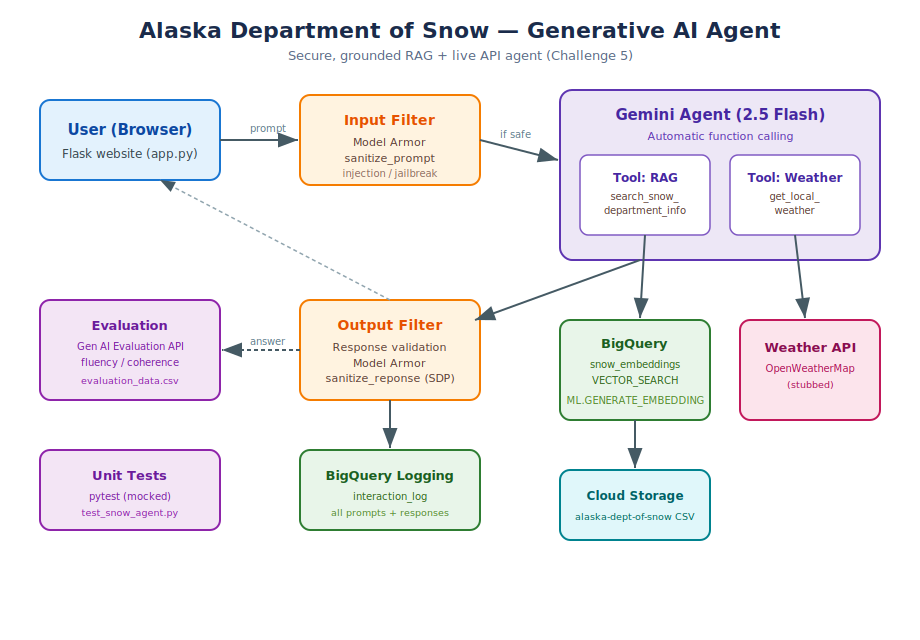

# Alaska Department of Snow — Generative AI Agent (Challenge 5)

A secure, grounded, production-quality generative AI agent for the fictional Alaska Department of Snow. It answers citizen questions about snow removal and department services from a private knowledge base, and reports current weather/snow conditions from an external API. Built on Vertex AI Gemini with BigQuery RAG, Model Armor security, BigQuery logging, unit tests, and Gen AI Evaluation.

## Architecture

A request flows: **Browser → Flask → Model Armor input filter → Gemini agent (automatic function calling) → BigQuery RAG and/or Weather tool → response validation → Model Armor output filter → BigQuery log → Browser.**

## Repository contents

| File | Description |
|---|---|
| `challenge5_alaska_snow_agent.ipynb` | Main notebook — builds and demonstrates the whole solution, step by step |
| `app.py` | Standalone Flask web app (deployable; the website artifact) |
| `snow_agent_logic.py` | Testable extraction of the core logic (dependencies injected) |
| `test_snow_agent.py` | pytest unit tests (mocked, fast, offline) |
| `evaluation_data.csv` | Evaluation dataset + scores from the Gen AI Evaluation API |
| `architecture_diagram.svg` | Solution architecture diagram |

## Requirements mapping

| Requirement | Where it is met |
|---|---|
| Backend data store for RAG | BigQuery `snow_embeddings` table + `VECTOR_SEARCH` (notebook Step 1) |
| Access to backend API functionality | Weather tool via Gemini function calling (Step 2–3) |
| Unit tests for agent functionality | `test_snow_agent.py`, run with pytest (Step 6) |
| Evaluation data via Google Evaluation service API | `EvalTask` pointwise metrics; `evaluation_data.csv` (Step 7) |
| Prompt filtering and response validation | Model Armor `sanitize_prompt` / `sanitize_reponse` + Gemini safety + empty-response check (Step 4) |
| Log all prompts and responses | BigQuery `interaction_log` table (Step 5) |
| Generative AI agent deployed to a website | Flask `app.py` (Step 8) |
| Architecture diagram | `architecture_diagram.svg` |

## Data source

RAG content is loaded from `gs://labs.roitraining.com/alaska-dept-of-snow` (CSV), embedded with `text-embedding-005`, and stored in BigQuery.

## How to run

1. Open `challenge5_alaska_snow_agent.ipynb` in Colab Enterprise.
2. Set `PROJECT_ID` to your project.
3. Run the install cell at the top, then run the steps in order. Step 1 creates the dataset, loads the CSV, builds the Vertex AI connection, and generates embeddings (the connection/IAM grant needs a minute to propagate).
4. Run the tests: the pytest cell in Step 6 (`!python -m pytest test_snow_agent.py -v`).
5. Run the evaluation in Step 7 to produce `evaluation_data.csv`.

### Running the website
- Local: `python app.py`, then open the forwarded port.
- Cloud Run: containerize `app.py` (listens on `$PORT`, default 8080) and deploy.

## Notes
- Model: `gemini-2.5-flash` (the 2.0 Flash models were retired in June 2026). Output token budget is set high to leave room for the model's reasoning tokens.
- The weather API is stubbed; swapping in the real OpenWeatherMap call is a single-function change documented in the code.
- Lab projects have tight Vertex AI quotas; the agent calls use retry with exponential backoff to handle 429 rate-limit errors.
- Security filters fail closed: if Model Armor is unavailable, the request is blocked rather than passed through.
